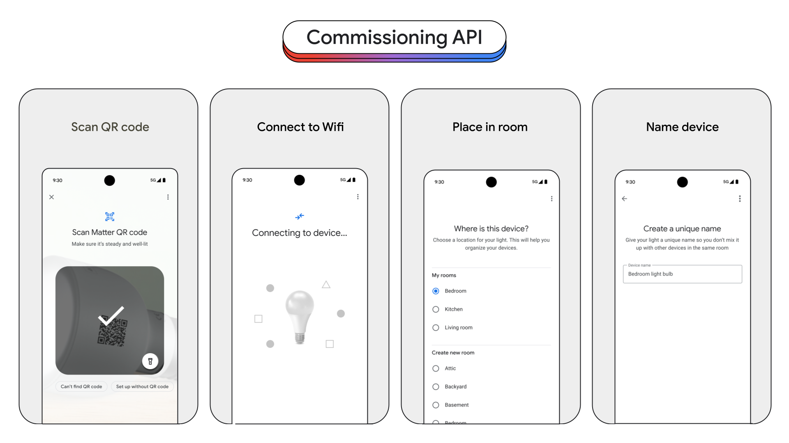
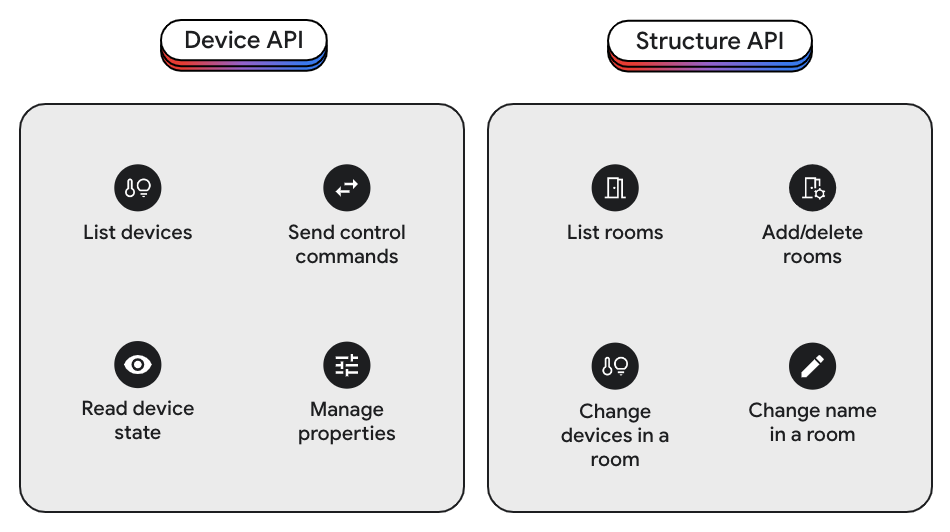
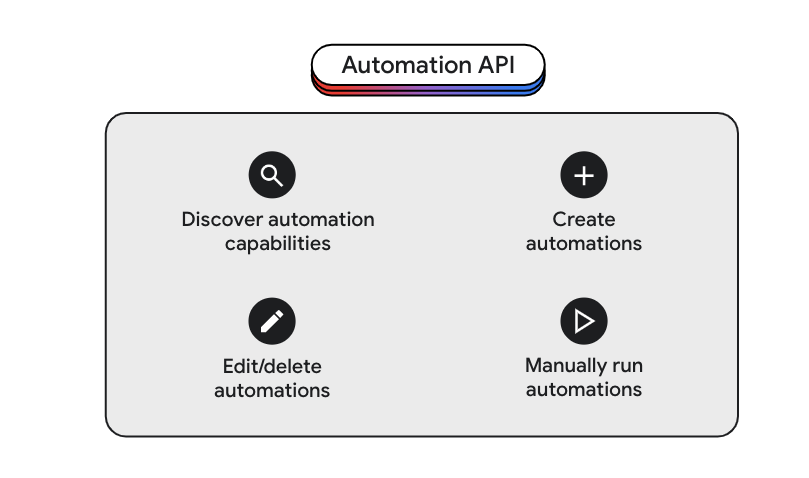

# Kết nối và sử dụng các thiết bị thông minh

## I. Giới thiệu
- Bài viết giới thiệu về giao thức Matter và 2 cách kết nối đến các thiết bị thông minh hỗ trợ Matter từ ứng dụng sử dụng Home Mobile SDK và Home APIs

## II. Giao thức Matter

- Matter là một tiêu chuẩn cho công nghệ smart home cho phép các thiết bị từ các nhà sản xuất khác nhau hoạt động với bất kỳ hệ sinh thái nào được chứng nhận Matter (Matter-certified) sử dụng một giao thức duy nhất.
- Matter được tạo ra bởi [Connectivity Standards Alliance](https://csa-iot.org/), một tổ chức gồm hàng trăm công ty sản xuất sản phẩm smart home.
- Tìm hiểu thêm về matter tại https://developers.home.google.com/matter/overview

## III. Home Mobile SDK

- Để hỗ trợ phát triển và xây dựng các ứng dụng Android tương tác với các thiết bị hỗ trợ Matter, Google đã phát triển Google Home Mobile SDK.
- Google Home Mobile SDK cung cấp các API để kết nối và chia sẻ các thiết bị thông minh
- Flow kết nối thiết bị sử dụng Google Home Mobile SDK

  
  
  1. Khi có yêu cầu kết nối thiết bị, ứng dụng gửi yêu cầu qua cho Google Play Service.
  2. Google Play Service yêu cầu người dùng quét mã QR hoặc nhập mã của thiết bị cần kết nối.
  3. Google Play Service sẽ thiết lập kết nối giữa ứng dụng và thiết bị
- Tìm hiểu thêm tại https://developers.home.google.com/matter/apis/home

## IV. Home APIs

- Home APIs được tạo ra bởi Google, giúp ứng dụng truy cập đến hơn 600 triệu thiết bị thông minh và có khả năng sử dụng các công cụ tự động hóa được cung cấp bởi Google. Hỗ trợ phát triển với cả Android và IOS
- Ta có thể sử dụng Home APIs để kết nối, điều khiển các ứng dụng thông minh thông qua nền tảng Google Home
- Home APIs cung cấp cho chúng ta các API sau:
  1. Commission API dùng để thiết lập kết nối đến các thiết bị thông minh

  
  
  2. Device và Structure API dùng để điều khiển các thiết bị thông minh

  

  3. Automation API dùng để sử dụng các công cụ tự động hóa được cung cấp bởi Google
  
  

- Home APIs chưa được ra mắt chính thức
- Tìm hiểu thêm tại https://developers.googleblog.com/en/home-apis-enabling-all-developers-to-build-for-the-home/